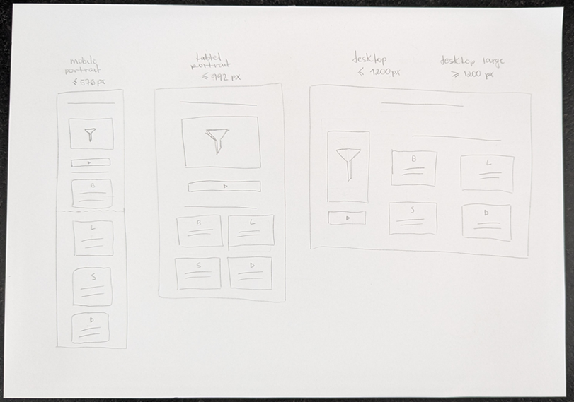
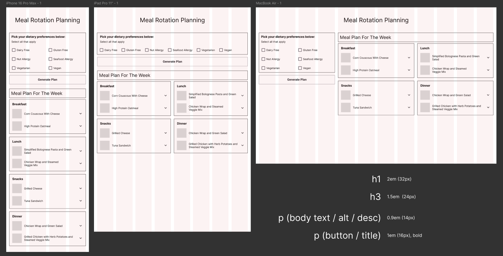

# Idea: Meal Rotation Planning App

# Development Plan | _due 26/05_

## ☕ Phase 3 | _due 26/05_ (implement API + more detailed output)
- [x] ~~Integrate with external recipe API~~ ([Spoonacular](https://spoonacular.com/food-api/docs))
- [x] ~~Display photo for each recipe~~
- [ ] Let user regenerate individual recipes in the meal plan
- [ ] Add recipe details (accordion optional)
- [ ] Name the app
- [ ] Visual:
  - [ ] custom checkboxes
  - [ ] add min-width
  - [ ] implement color palette / gradient BG
  - [ ] add emojis?
 
## ✅ Phase 2 | _due 20/05_ (design)
- Implement basic responsive design
  - [x] ~~Sketch quick paper wireframes for desktop, tablet, mobile~~
    - ref breakpoints: https://getbootstrap.com/docs/5.0/layout/breakpoints/)
    - sketch:
    - 
  - [x] ~~Design wireframes on Figma~~
    - wireframes:
    - 
    - [Click to Access Figma File](https://www.figma.com/design/UBPPA8SqRHvv5BVn6uhY4d/Meal-Planner?node-id=0-1&t=xfkfwliooCBffYU8-1)
  - [x] ~~Define visual style for the project on Figma~~
  - [x] ~~Implement design (mobile first)~~
  - [x] ~~Implement responsive design (tablet + desktop)~~

## ✅ Phase 1 | _due 13/05_ (working output with limited flexibility)
- User selects intolerances, allergies or preferences (e.g. don't recommend peanuts / gluten)
  - [x] ~~To do: form to select intolerances~~
- App fetches recipes from local database based on user preferences (while no API)
  - [x] ~~To do: Create hardcoded recipe database for testing (while no API)~~
  - [x] ~~To do: DOM manipulation - extract user preferences from the form~~
  - [x] ~~To do: filter recipes by ingredients~~
- App generates a 1-week meal plan (e.g. 2 options for each meal (breakfast, lunch, snack and dinner), reused across the week)
  - [x] ~~To do: return plan with randomized recipes to yield enough meals for a week~~

## 💭 Wishlist of future improvements
- Button to clear filter selection
- Visual: "Finding recipes..." (short delay with animation)
- Show calories and macros for each portion
- Allow user to add their own recipes
- Allow user to customize portion size (maybe according to calories / macro goals?)
- Import recipes from links (eg recipe blogs)
- Rating recipes: suggest more/less/nothing of a given recipe
- Allow users to save recipes in a collection (consider Window:local storage https://developer.mozilla.org/en-US/docs/Web/API/Window/localStorage ?)
- Save user preferences to create a new plan, based on a rotation of liked and saved recipes
- Allow user to customize plan (maybe similar to https://coolors.co/)
- Import plans/recipes from dietitians
- Allow to filter by level of difficulty
- Suggestions: a recipe you might like for the weekend
- More personalization:
  - Let user select preferred ingredient for a meal
  - Let user define a meal plan structure selecting n meals/day, n days, n times they want to cook 
  - Let user pick how many ideas they want per meal (counter 1 to 7)
  - Let use toggle meals on/off (eg only lunch and dinner)

## Product Concept: Jobs to be Done

### 1. Pre-prepped Meals
- **WHEN** it’s time to eat, or I’m feeling hungry,
- **I WANT TO** have a meal already prepared and waiting,
- **SO I CAN** eat right away without having to make decisions or use mental energy when I’m tired or low on focus.

### 2. Quick Familiar Meal Decisions
- **WHEN** it’s time to eat, or I’m feeling hungry,
- **I WANT TO** haves access to easy meals that are familiar to me,
- **SO I CAN** cook something quickly and effortlessly without having to think or search for options.

## Core Problem
- Decision fatigue and low energy around mealtimes.
- I want to avoid the mental load of choosing or planning when it’s time to eat.

## Functional Job
- Make meals easier by having them pre-decided or pre-prepped.
- Reduce the time and energy required during mealtimes.

## Emotional Job
- Avoid stress and frustration when hungry.
- Feel in control and cared for by your past self.